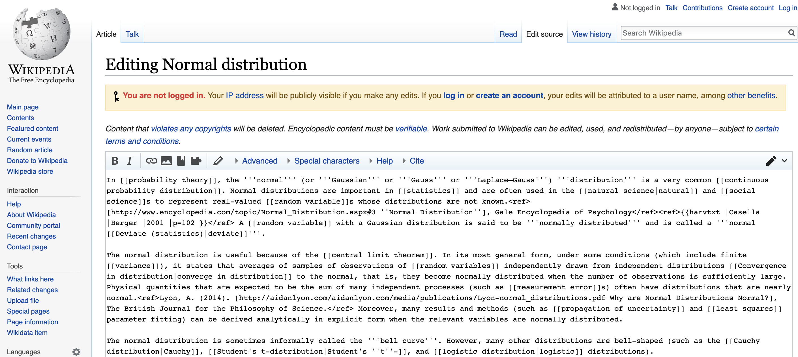
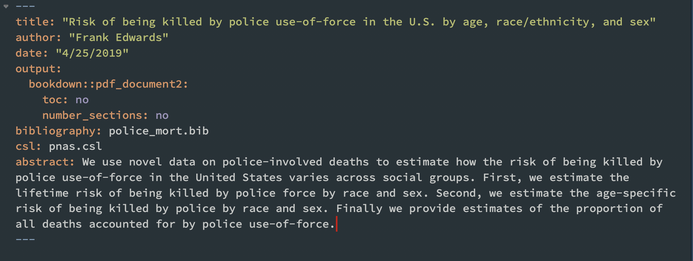
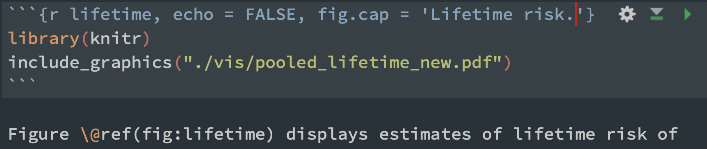
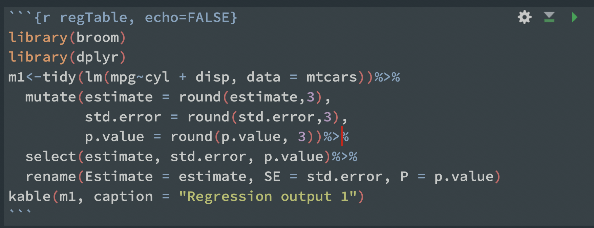
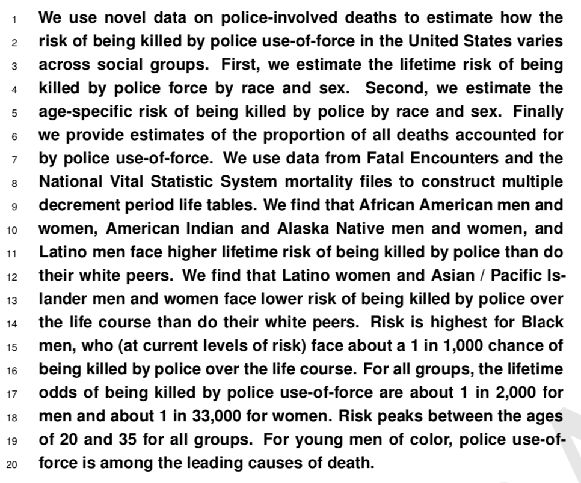

```{r setup, echo = FALSE, message = FALSE}
rm(list=ls())
library(tidyverse)
library(broom)
select<-dplyr::select
set.seed(1)

options(xtable.comment = FALSE)
theme_set(theme_bw())
def.chunk.hook  <- knitr::knit_hooks$get("chunk")
knitr::knit_hooks$set(chunk = function(x, options) {
  x <- def.chunk.hook(x, options)
  ifelse(options$size != "normalsize", paste0("\\", options$size,"\n\n", x, "\n\n \\normalsize"), x)
})
knitr::opts_chunk$set(warning=FALSE, message=FALSE, tidy = TRUE, size = "small")
```

# Homework review

# Writing quantitative research in plain text (markdown/LaTeX)

## Advantages of plain text authoring

- It isn't Word. Word is a WSIWYG editor, lots of code behind the scenes (xml)
- Your focus is on your writing
- You can seamlessly embed external files or code/code output
- Code and text should live together
- It easily converts to/from other formats
- With LaTeX, it can make very pretty documents
- Version control with Git/Github
- Nerd cred

## Disadvantages of plain text authoring

- Your co-authors or advisor might not like it
- Some journals prefer submissions in word
- A bit of a learning curve if you start working with LaTeX a lot

# Using markdown

## What is markdown?

- Markdown is a lightweight markup language with plain text formatting syntax. Its design allows it to be converted to many output formats, but the original tool by the same name only supports HTML.

- RMarkdown is an adaptation of markdown that is specifically geared toward producing nice looking output using R

- RStudio can convert markdown into .docx, .pdf, or .html documents. It can also create slides and websites.

- All materials in this course are written in RMarkdown in RStudio

## Markdown is ubiquitous



## Markdown is pretty easy

- [Rstudio's rmarkdown site with lots of examples and tutorials](https://rmarkdown.rstudio.com/)
- [The cheat sheet](https://www.rstudio.com/wp-content/uploads/2015/02/rmarkdown-cheatsheet.pdf)

## Markdown lets you write nice math (via LaTeX)

- tutorial here: https://www.calvin.edu/~rpruim/courses/s341/S17/from-class/MathinRmd.html
- RMarkdown uses LaTeX math syntax, plenty of guides can walk you through how to write equations
- Example: $y \sim Normal(\mu, \sigma^2)$ or $y_i = e^{\beta_0 + \beta_1 x_1 + \beta_2 x_1^2}$
- eg1: ```y \sim Normal(\mu, \sigma^2)```
- eg2: ```y_i = e^{\beta_0 + \beta_1 x_1 + \beta_2 x_1^2}```


# Anatomy of an academic paper in plain text

## Before we begin

- install.packages("bookdown")
- use bookdown::pdf_document2 or book as your output: argument in RMD YAML header
- see quant_paper_demo.rmd for an example and nice defaults

## What your header might look like



## Cross references

- Cross references allow you to automagically number tables/figures and manage references seamlessly
- Only use numbers and letters in chunk labels for this to work

## Cross references for figures

- When using bookdown output types (book, pdf_document2)
- The chunk label becomes a reference label
- Chunk syntax: ```{r lifetime, echo = FALSE, fig.cap = 'Lifetime risk'}
- reference syntax: \\@ref(lifetime) 

## Cross references for figures



## Cross references for tables

- When using bookdown output types (book, pdf_document2)
- Use the kable() function from the knitr package
- Label for use with \\@ref() becomes the chunk label
- Format your table (data.frame) the way you want it to look in text with rename, select, mutate, etc

## Cross references for tables



# Bibliographies

## General advice

- Use Zotero, or some other citation management software
- Don't write bibliographies by hand, make it automated
- In most word processing software, Zotero can auto-populate citations and bibliographies
- We will use Zotero and BibTeX to make ours in .RMD files

## Creating a .bib file from Zotero

- File -> export library -> format: BibTeX, no options checked
- Save as library.bib (filename is arbitrary) in your project directory
- Add a line to your rmarkdown YAML header: bibliography: library.bib

## Using a .bib file

- BibTeX is a simple plain text bibliography format
- It's integrated into nearly all citation software, including Zotero and Google Scholar (show)
- You use citation keys to reference articles/books/etc
- You don't need to know how to write BibTeX
- The citr package does autocomplete, but we'll work from the .bib file directly

## Finding keys in a .bib file


## Adding a citation and references section

- You can cite a reference in your .bib file easily using [@key]
- Multiple citations [@key; @key1]
- Add a references section to the document with # References. It will include all entries cited in the document

## CSL Files

- You can modify your citation and bibliography style on the fly with a .csl file
- https://www.zotero.org/styles has thousands of styles available
- After adding the csl file to your project directory, add csl: filename.csl to your YAML header

# Anatomy of a quantitative paper

## Abstract (150-250 words)

- Describe your research question (or goal) in 1-2 sentences
- Explain the theoretical significance of your RQ in 1-2 sentences
- Succinctly explain your data and methods in non-technical terms (1-2 sentences)
- Explain your major findings in 1-2 sentences
- Explain major implications in 1 sentence

## An abstract I wrote recently



## Introduction

- P1-2: Why is this an important topic
- P3-4: Gaps in knowledge or importance of current study
- P5: Brief summary of research design
- P6: Brief summary of findings and implications

## Lit review

- Never title it lit review
- Never think of it as a lit review in which you systematically explain what people have previously said
- Instead, think of it as a way to set up your argument
- Focus on two goals: useful theoretical concepts; necessary empirical foundations
- Group your citations and discussion around a) concepts and b) facts, rather than around authors
- Only call out authors if they are super important to your work, or you are conducting a replication / direct response
- For most quant papers, these will be brief (1-4 pages). 

## Analytic strategy

- Provide a big picture overview of the logic of what you are doing
- Focus on constructs, not variables
- Focus on the big picture of inference rather than particular models

## Results

- Provide a series of visuals (2-6?)
- Focus your explanations on walking the reader through each of the visuals in sequence
- Explain in detail what each visual shows 
- Provide summaries of results not included in visuals when relevant
- Focus on interpretability: provide results in easy-to-interpret units (i.e. probability rather than log-odds)

## Discussion

- Answer two questions: 1) What did we learn? 2) Why does it mattter?
- P1-3 should address these questions
- P4 should provide a (brief) discussion of concerns/limitations. Don't go overboard
- P5 should tie it all together with a nice summary of the paper and its implications