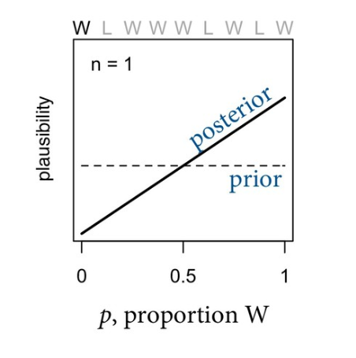
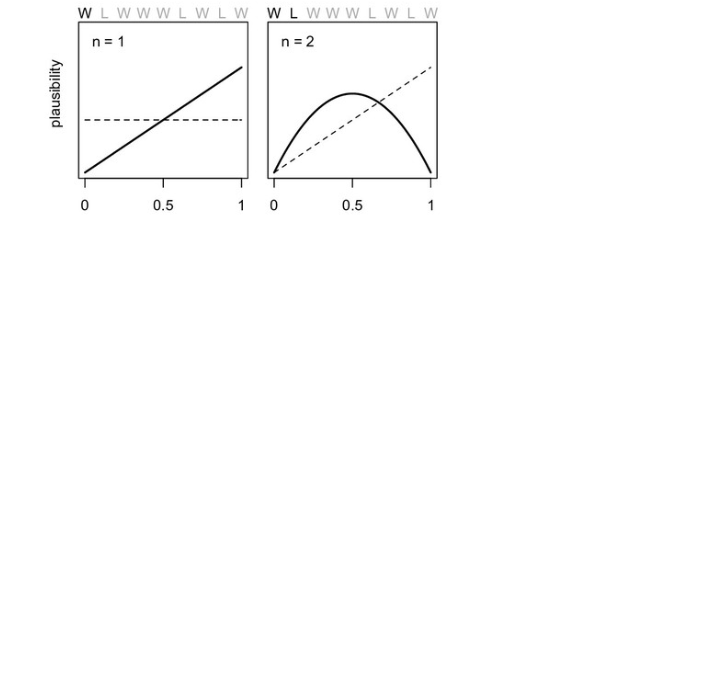

```{r setup, include=FALSE}
library(tidyverse)
library(rethinking)

theme_set(theme_bw())
def.chunk.hook  <- knitr::knit_hooks$get("chunk")
knitr::knit_hooks$set(chunk = function(x, options) {
  x <- def.chunk.hook(x, options)
  ifelse(options$size != "normalsize", paste0("\\", options$size,"\n\n", x, "\n\n \\normalsize"), x)
})
knitr::opts_chunk$set(warning=FALSE, message=FALSE, tidy = TRUE, size = "small")
```

# Getting Started

## Before we get started: R, Rstudio, and packages

1. Install /  update R if needed (https://cran.r-project.org/)
2. Install / update RStudio if needed (https://rstudio.com/)
4. Install rstan (https://github.com/stan-dev/rstan/wiki/RStan-Getting-Started)
5. Install rethinking package (https://github.com/rmcelreath/rethinking/tree/Experimental)

## Before we get started: Git

- Install Git (https://git-scm.com/)

1. Open your terminal [Mac, Linux] or Git Bash [Windows]

```
cd Dropbox [Arbitrary! choose any location you like]
git clone https://github.com/f-edwards/intermediate_stats.git
```

2. Then, to update with the latest slides / data / etc

```
cd Dropbox/intermediate_stats
git fetch
```

## If you feel lost

- This course closely follows McElreath's *Statistical Rethinking*
- His lectures and slides for the course are available for further review (github.com/rmcelreath/statrethinking_winter2019)
- My slides borrows liberally from the book and his materials

# All models are wrong...

## So why do statistics?

- Learn about something we can't see (parameters) from something we can (data) \pause
- Models (**golems** for McElreath) are very powerful, but very dumb \pause
- Statistical models $\neq$ scientific models 

## All models are wrong, but some are useful

- We create stylized abstractions of reality in our models (McElreath's **small world**) \pause
- They are always incomplete representations of reality (**large world**) \pause
- Models answer questions about the **small world**. It's up to us to carefully translate them to the large world. \pause
- Also, Columbus was a slaver and initiated a catastrophic genocide

## Interpret these results

```{r size = "scriptsize"}
library(broom)
data(mtcars)
## mpg is miles per gallon, wt is weight in 1000 lbs
m1<-lm(mpg ~ wt, data = mtcars)
tidy(m1)
confint(m1)
```

## Motivating two common approaches

- Frequentist: The truth is fixed, we can estimate it using repeated sampling and large number theorems, assuming our measurement is one of many that could have resulted \pause
- Bayesian: Given our assumptions and the data, which probability distribution is the most plausible answer? 

## Why Bayesian?

- A more intuitive approach to interpreting statistical models (no more sampling distributions!) \pause
- Computational costs have decreased rapidly \pause
- Priors are a useful way to incorporate what we already know \pause
- Avoids overfitting by not trusting the data too much \pause
- Applications in scientific inference, prediction, machine learning

# Probability: how many ways could what happened have happened?

##


Stolen from [McElreath's slides](https://speakerdeck.com/rmcelreath/l01-statistical-rethinking-winter-2019)

##


##


##


##


##


##


##


##


##


##


## Adding other information

Draw one new marble: it is Blue

|Conjecture|Ways to produce B | Prior counts | New count|
|---|---|---|---|
|WWWW |0|0|$0 \times 0 = 0$|
|BWWW |1|3|$1 \times 3 = 3$|
|BBWW |2|8|$2 \times 8 = 16$|
|BBBW |3|9|$3 \times 9 = 27$|
|BBBB |4|0|$4 \times 0 = 0$|

## Moving to probability

\centering{

plausability of [BWWW] after seeing [B] $\propto$

ways [BWWW] can produce B $\times$

prior plausbility of [BWWW] based on draw [BWB]
}

## Bayes' rule

\[P(B|A) = \frac{P(A|B) P(B)} {P(A)}\]

\[P(\textsf{parameter}|\textsf{data}) = \frac{P(\textsf{data}|\textsf{parameter}) P(\textsf{parameter})}{P(\textsf{data})}\]

Or in Bayesian vernacular:

\[\textsf{Posterior} = \frac{\textsf{Likelihood} \times\textsf{Prior}}{\textsf{Average probability of the data}}\]

## Updating our estimate of plausability of each parameter

Let's indicate the possible bag compositions with the parameter $\theta$


|$\theta$|$pl(B|\theta)$|Prior $pl(\theta)$|Posterior $pl(\theta|B)$|
|---|---|---|---|
|WWWW |$\frac{0}{4}$|$\frac{0}{20}$|$\frac{0}{4} \times \frac{0}{20}$|
|BWWW |$\frac{1}{4}$|$\frac{3}{20}$|$\frac{1}{4} \times \frac{3}{20}$ |
|BBWW |$\frac{2}{4}$|$\frac{8}{20}$|$\frac{2}{4} \times \frac{8}{20}$ |
|BBBW |$\frac{3}{4}$|$\frac{9}{20}$|$\frac{3}{4} \times \frac{9}{20}$ |
|BBBB |$\frac{4}{4}$|$\frac{0}{20}$|$\frac{4}{4} \times \frac{0}{20}$ |

## Nomenclature

- A hypothetical composition of the bag of marbles $\theta$ is a **parameter**, and is unknown \pause
- The number of ways that a parameter could produce the data is a **likelihood** \pause
- The plausability of any value of $\theta$ before we conduct the experiment is a **prior probability** \pause
- The new, updated plausability of any value of $\theta$ is a **posterior probability**

## Model building

- New experiment: Toss a globe, catch it, and note whether your right index finger has landed on water or land
- Suppose the first nine attempts (samples) result in the data: Water, Land, Water, Water, Water, Land, Water, Land, Water (WLWWWLWLW)

## The model building design sequence

1. Design a model (a story about how the data might arise) \pause
2. Update: Educate the model by conditioning on the data \pause
3. Evaluate: compare, critique, and revise the model \pause
4. Repeat!

## Design a model (tell a story)

How do we obtain the data we observed?

1. The true proportion of water on the globe is $p$ \pause
2. A single toss of the glove has probability $p$ of producing a water (W) observation, and $1-p$ of producing a land (L) observation \pause
3. Each toss is independent of all other tosses

## Bayesian updating

How do we use the evidence to evaluate which proportion of water on the globe is true?

- Begin with a set of plausabilities for each possible value of the parameter $p$ (prior) 
- Update these plausabilities after collecting the data (posterior) \pause

To begin, let's assume a prior where each value of $p$ is equally likely (a uniform distribution)

## Probability densities

Recall that we can use a **probability density function** to describe the likelihood that a parameter takes on any particular value. 

```{r echo = F, fig.height = 4}
ggplot(data = data.frame(x = c(-3, 3)), aes(x)) +
  stat_function(fun = dnorm, n = 101, args = list(mean = 0, sd = 1)) + ylab("") +
  ggtitle("x ~ N(0,1)")
```

## Probability densities

Our prior, a uniform distribution for a proportion on [0,1]

```{r echo = F, fig.height = 4}
ggplot(data = data.frame(x = c(-0, 1)), aes(x)) +
  stat_function(fun = dunif, n = 101, args = list(min = 0, max =1)) + ylab("") +
  ggtitle("x ~ Unif(0,1)")
```

## The basic mechanics of Bayesian updating: The prior and posterior



##


##


 
##


##


##


## Evaluate

Our approach gives us a logical answer to this question:

"How plausible is each proportion of water, given these data and our model". \pause

1. Model certainty is no guarantee that your model accurately captures the real world \pause
2. Check how the answer changes based on changes in your assumptions (priors, model)

## Components of a model

We have two kinds of variables: *parameters* (unobserved), and observed variables

- For each *parameter*, we must specify a  **prior** distribution that tells us the plausability of each possible value of the parameter \pause
- For observed variables, we define how likely each combination of observed variables is for a specific value of $p$; a **likelihood**. 

## For the globe tossing model

- What is the parameter of interest? \pause
- What are the observed variables?

## For the globe tossing model

- What is the parameter of interest? $p$: *the proportion of the globe covered in water* \pause
- What are the observed variables? $W, L$: *the counts of water and land results*

## Likelihood for the observed variables

With two outcomes $[W,L]$, and the assumptions that

1. Each toss is independent
2. The probability of W is the same on every toss \pause

The probability of any number of $W$ values for $N$ tosses for each possible value of $p$ can be defined using the binomial distribution as our likelihood. \pause

\[W \sim Binomial(p, N)\]

Read: W is distributed binomially, with a probability of landing on Water $p$ on each toss, and $N$ total tosses

## Using the binomial distribution in R

If we want to know the probability of obtaining $W=5$ when $N=7$ and $p=0.5$

```{r echo = T}
## binomial probability density
dbinom(x=5, size=7, prob=0.5)
```

## A prior distribution for each parameter

- Each unobseved variable, or parameter $p$, must be assigned a distribution of *prior* plausability. \pause
- The prior is an initial assignment of how likely each possible value of $p$ is. \pause
- Priors may reflect information from other sources, or beliefs \pause
- The prior choice is arbitrary, but consequential! \pause
- Priors are assumptions, and can be modified and critiqued

## For the globe tossing model

Let's assume that all values of $p$ are equally likely: that the globe could have any proportion of water between 0 and 1 \pause

This prior is described by a *Uniform* distribution

\[p \sim Uniform(0,1) \]
\[Pr(p) = \frac{1}{1-0}\]

## Probability densities: prior distribution

We are assuming that the globe could have any proportion of water between 0 and 1, and that each proportion is equally likely - a uniform distribution (flat prior) \pause

```{r echo = F, fig.height = 4}
library(gridExtra)
ggplot(data = data.frame(x = c(0, 1)), aes(x)) +
  stat_function(fun = dunif, n = 101, args = list(min = 0, max = 1)) + ylab("") +
  ggtitle("x ~ Unif(0,1)")
```

## How priors influence our inferences


## Estimation strategies

Because we are computing the product of probability distributions there sometimes aren't exact solutions.

\[P(\textsf{parameter}|\textsf{data}) = \frac{P(\textsf{data}|\textsf{parameter}) P(\textsf{parameter})}{P(\textsf{data})}\] \pause

We'll rely on 3 algorithms to *approximate* posterior distributions to condition the prior on the likelihood of the data. 

- Grid approximation (today) 
- Quadratic approximation (weeks 2 on)
- Markov Chain Monte Carlo (MCMC) (week 7 or 8 on)

## Grid approximation algorithm

1. Define the grid 
2. Compute the prior for each parameter value on the grid
3. Compute the likelihood for each parameter value on the grid
4. Multiply the prior by the likelihood
5. Divide by the sum of all values

## Grid approximation in R

```{r size = "tiny", tidy = F}
length <- 7
# 1 define the grid
grid<-seq(from = 0, to = 1, length.out = length)
grid
#2. Compute the prior for each parameter value on the grid
prior  <-  rep(1, length)
prior
#3. Compute the likelihood for each parameter value on the grid for the observed data
likelihood  <-  dbinom(6, size = 9, prob = grid)
likelihood
# 4. Multiply the prior by the likelihood
# 5. Divide by the sum of all values
posterior <- prior * likelihood / sum(prior * likelihood)
posterior
```

## Plot it, grid size 7

```{r fig.height = 4, size = "tiny", tidy =F}
plot_dat<-tibble(grid, posterior)
ggplot(plot_dat,
       aes(x = grid, y = posterior)) + 
  geom_line()
```

## Plot it, grid size 20

```{r size = "tiny", echo =F}
length <- 20
### make our grid
grid<-seq(from = 0, to = 1, length.out = length)

### make our prior and likelihood 
### remember uniform distributions are p(x) = 1/b-a, and b=1, a =0
### and we observe 6 Waters in 9 Trials
prior  <-  rep(1, length)

likelihood  <-  dbinom(6, size = 9, prob = grid)

posterior <- prior * likelihood / sum(prior * likelihood)

plot_dat<-tibble(grid, prior, likelihood, posterior)
ggplot(plot_dat,
       aes(x = grid, y = posterior)) +
  geom_line()
```

## Plot it, grid size 100

```{r size = "tiny", echo =F}
length <- 100
### make our grid
grid<-seq(from = 0, to = 1, length.out = length)

### make our prior and likelihood 
### remember uniform distributions are p(x) = 1/b-a, and b=1, a =0
### and we observe 6 Waters in 9 Trials
prior  <-  rep(1, length)

likelihood  <-  dbinom(6, size = 9, prob = grid)

posterior <- prior * likelihood / sum(prior * likelihood)

plot_dat<-tibble(grid, prior, likelihood, posterior)
ggplot(plot_dat,
       aes(x = grid, y = posterior)) + 
  geom_line()
```

## What if we used a different prior?

- The Uniform prior is flat - but we know that Earth is mostly water, right? \pause
- In your homework, you will estimate the posterior distribution under a different prior distribution. \pause
- Hint 1: A Uniform distribution assigns zero probability to regions outside of its interval, and $\frac{1}{b-a}$ probability density to all values inside the interval. \pause
- Hint 2: ifelse() is a very useful function.
